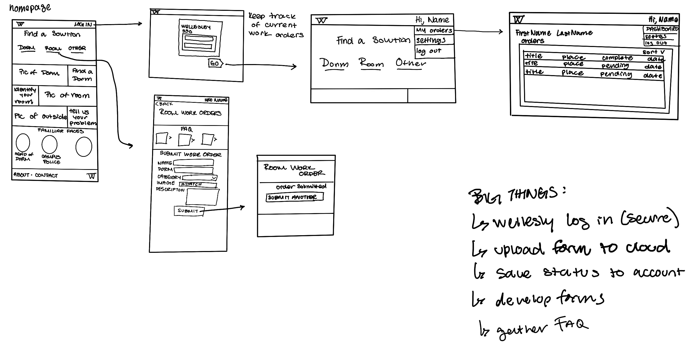

# Work Order Interface  

Our project aims to address the issue of the inaccessibility of Wellesley's work orders website for students. Currently, the platform lacks a cohesive way to submit work orders and does not support access from mobile devices. This creates significant challenges for students, particularly in urgent situations such as dorm heating issues in cold MA winters.  We will develop an intuitive Wellesley work orders webpage with CSS, and HTML. The platform will offer effective communication with maintenance staff and will be accessible on both mobile devices and PCs. 

## 🤹‍♀️ Features
- **Create Request**  
- **See past requests**  
- **See pending requests**
- **feedback form**
- **secure log in**
- **FAQ section**
- **Facility contact info**

## 🛠️ Project Goals  
1. **Create a User-Friendly Interface**  
   - Design an intuitive and streamlined webpage for Wellesley work orders.  

2. **Seamless Staff Communication**  
   - Enable users to connect with staff quickly and efficiently.  

3. **Accessibility Across Devices** *(Optional)*  
   - Ensure the platform is accessible and responsive on both phones and PCs.  

## 🧰 Tools and Technologies  
- **Voiceflow**  
- **HTML**  
- **CSS**  

## 📐 Milestones
- Milestone 1 (end of today): get base files onto GitHub, start base HTML / CSS templates 
- Milestone 2 (end of Wednesday): edit and refine the code for the website
   - at least the front home page
      - Sign in
      - 3 categories of services with images
      - Faces of people to reach out to (CD’s, Head of the maintenance, Campus Police)
- Milestone 3 (end of Thursday):
   - Tracking work order feature
   - work on the website visually   
- Milestone 4 (Friday): troubleshoot and polish 

## 👩‍🎨 Low Fidelity Wireframes

